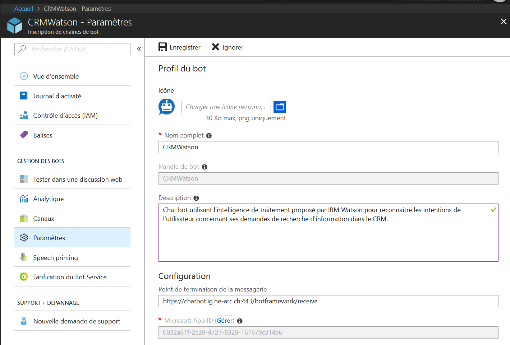
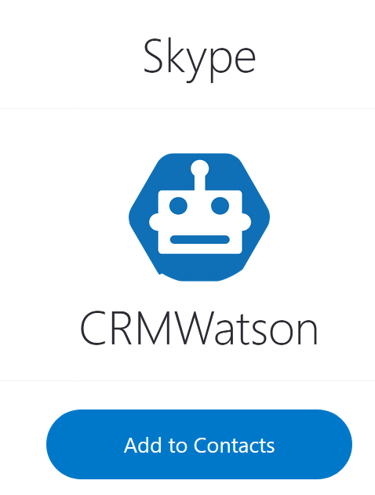

# TB-ChatBot-CRM
Projet de mise en place d'un chat bot fonctionnant avec la plateforme chat bot IBM en effectuant des traitements métier à travers le middleware Botkit avec entre autre des recherches dans une base SGBD mySQL.

Les informations ci-dessous vont permettre de déployer le projet mis en place.

## Infrastrcture SQL pour démonstration et tests
_**Cette démonstration repose sur l'utilisation du SGBD MySQL. Aucune garantie n'est faite sur la compatibilité des codes SQL présentés avec d'autres SGBD**_

### Création du schéma et des tables
Utiliser le code SQL de création de schéma et des tables se trouvant dans le fichier `sql/create.sql`.
Ce code SQL va créer toutes les tables nécessaires.

### Peuplement des tables
Utiliser le code SQL de peuplement des tables se trouvant dans le fichier `sql/populate.sql`.
Ce code SQL va insérer des jeux de données dans les tables précédemment créées,

### MLD
Le modèle logique de données(MLD) utilisé pour modéliser le schéma et les tables de ce projet est disponible à travers le fichier `sql/MLD_TB_ChatBot_CRM.mwb`.
Pour exploiter ce fichier il faut disposer du logiciel [MySQL Workbench](https://www.mysql.com/fr/products/workbench/)

## Plateforme chat bot IBM Watson Assistant
_**Cette démonstration repose sur l'utilisation de la plateforme IBM Waston Assistant. Pour créer ou déployer un workspace il est nécessaire de disposer d'un compte IBM bluemix**_

### Importation du workspace "TB - Chat Bot CRM"
Dans le site web [IBM Watson Assistant](https://assistant-us-south.watsonplatform.net) aller sous l'onglet "workspaces" et importer le fichier en utilisant le bouton "import workspace" à disposition dans la page. Sélectionner le fichier `configuration_IBMWatsonAssistant/TB_ChatBot_CRM_confWatson.json` afin d'ajouter le workspace de ce projet composé des intentions, entités, contextes et dialogues nécessaire à ce projet


### Récupération des informations de déploiement
Afin de pouvoir exploiter ce workspace à travers un middleware il va être nécessaire de récupérer certaines informations. Ces informations vont permettre de légitimer la connexion entre le middleware et le workspace mis en place sur IBM Watson Assistant.

Sous le menu "Deploy" à gauche de la page, il est possible de récupérer les 3 valeurs nécessaires à l'utilisation du workspace par le middleware. Ces informations à récupérer sont :
* __Workspace ID__
* __Username__
* __Password__


Ces informations sont à reporter dans le fichier `.env` aux lignes concernées.

## Middleware
_**Cette démonstration repose sur l'utilisation du framework Botkit. Pour configurer à bien ce middleware il n’est nécessaire d'avoir récupéré certaines informations d'authentification auprès des services tiers qui sont utilisé**_

### Deploiement middleware
1) Si ce n'est pas déjà fait cloner le dépôt du projet
```bash
git clone https://gitlab.com/JoCharlet/TB-ChatBot-CRM.git
```
2) Aller dans le dossier `middleware`
```bash
cd middleware
```

3) Installer toutes les dépendances
```bash
mpm install
```

4) Configurer le fichier `.env` avec les valeurs d'authentifications des différents services tiers

**Valeurs de connexion au schéma mySQL déployé:**
```bash
# SQL
SQL_host=your_SQL_hostname
SQL_user=your_SQL_user
SQL_password=your_SQL_password
```

**Valeurs de connexion à la plateforme IBM WATSON Assistant:**
```bash
#WATSON
ASSISTANT_URL=https://gateway.watsonplatform.net/assistant/api
ASSISTANT_USERNAME=your_IBMBluemix_username
ASSISTANT_PASSWORD=your_IBMBluemix_password
WORKSPACE_ID=your_IBMBluemix_workspace_id
```

**Valeurs de connexion à Microsoft pour accéder au canal de communication Skype:**
```bash
#Microsoft Bot Info
MICROSOFT_APP_ID=your_Microsoft_app_id
MICROSOFT_APP_PASSWORD=your_Microsoft_app_password
```

**Quel type de chat bot est utilisé dans ce projet:**
```bash
#WHAT-TO-USE
USE_SKYPE=true
```

4) Démarrer le serveur node
```bash
node server.js
```

5) Tester le chat bot à travers Skype. Il devrait être à même de répondre à un "bonjour" et effectuer une recherche dans la base de données sur une question du type "Affiche moi la liste des entreprises"

## Configuration du canal de communication Skype
_**Pour mettre rendre disponible un chat bot sur Skype il est nécessaire de d'avoir un compte Microsoft Azure**_
Il va être nécessaire d'inscrire le chat bot sur "Azure Bot Service".
Dans les paramètres d'Inscription de chaînes de bot il va être possible de configurer les informations suivantes :
* Icône
* Nom complet
* Description
* Point de terminaison de la messagerie

Afin d'effectuer une connexion avec le middleware, il est nécessaire de récupérer les informations du "Microsoft App ID" ainsi qu'un mot de passe valide. Ces informations sont à reporter dans le fichier `.env` aux lignes concernées



## Ajout du chat bot dans Skype
Une fois le canal de communication correctement configuré, aller dans le menu "canaux" et cliquer sur "Skype". Cliquer ensuite sur le bouton "add to contacts" pour ajouter le chat bot à Skype et commencer à dialoguer avec.



---
[Jonathan Charlet](mailto:jonathan.charlet@bluewin.ch) 4IGTPart - 2018
