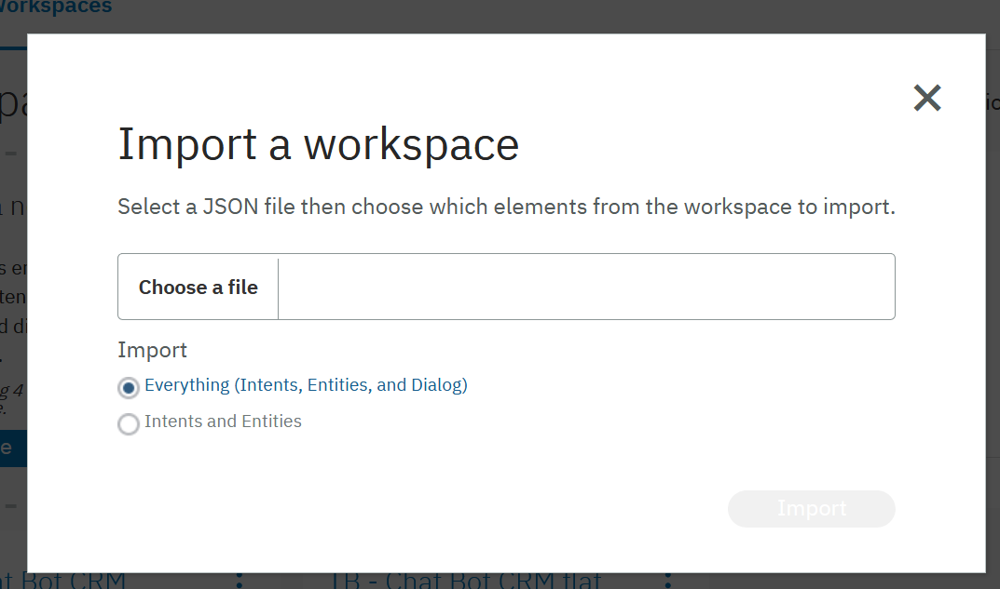
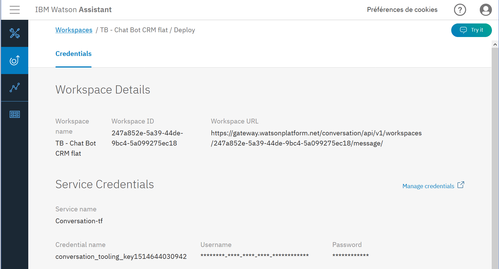

## Plateforme chat bot IBM Watson Assistant
_**Cette démonstration repose sur l'utilisation de la plateforme IBM Waston Assistant. Pour créer ou déployer un workspace il est nécessaire de disposer d'un compte IBM bluemix**_

### Importation du workspace "TB - Chat Bot CRM"
Dans le site web [IBM Watson Assistant](https://assistant-us-south.watsonplatform.net) aller sous l'onglet "workspaces" et importer le fichier en utilisant le bouton "import workspace" à disposition dans la page. Sélectionner le fichier `configuration_IBMWatsonAssistant/TB_ChatBot_CRM_confWatson.json` afin d'ajouter le workspace de ce projet composé des intentions, entités, contextes et dialogues nécessaire à ce projet

### Récupération des informations de déploiement
Afin de pouvoir exploiter ce workspace à travers un middleware il va être nécessaire de récupérer certaines informations. Ces informations vont permettre de légitimer la connexion entre le middleware et le workspace mis en place sur IBM Watson Assistant.

Sous le menu "Deploy" à gauche de la page, il est possible de récupérer les 3 valeurs nécessaires à l'utilisation du workspace par le middleware. Ces informations à récupérer sont :
* __Workspace ID__
* __Username__
* __Password__

Ces informations sont à reporter dans le fichier `.env` aux lignes concernées.

---
[Jonathan Charlet](mailto:jonathan.charlet@bluewin.ch) 4IGTPart - 2018
